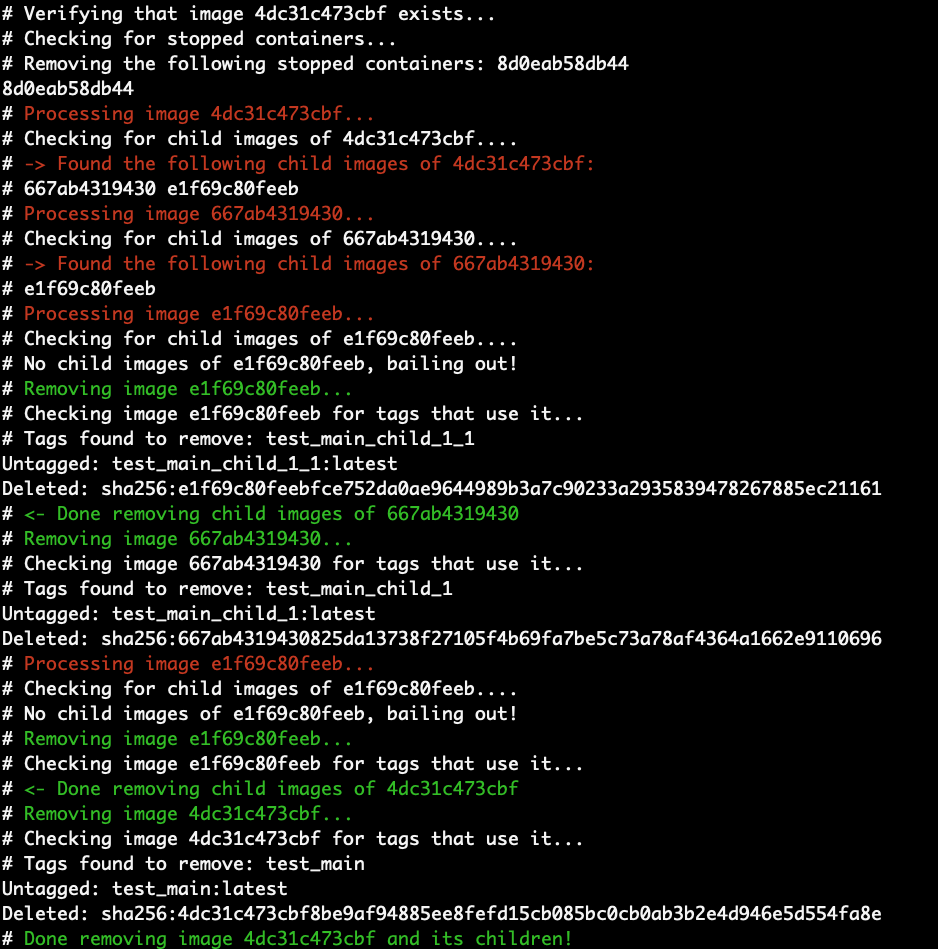

# Script to remove dependent child images of a Docker Container

As much as I love using Docker, one of the frustrations I have is when I try to remove an 
an image which other images are based on, only to get this error:

```
$ docker rmi b171179240df
Error response from daemon: conflict: unable to delete b171179240df (cannot be forced) - image has dependent child images
```

I did some searches on Google, and most of the advice centered around the heavy-handed approach of
removing **all** Docker images and basically starting over with a clean slate.  That approach didn't set well
with me because it doesn't strike me as all that efficient, and also causes me to have to spend more time
waiting for unrelated containers to build.

That prompted me to write a script which, when provided with the ID of a container to remove, will
recurse through all child containers and delete them first.


## Quick and Dirty Usage

`bash <(curl -s https://raw.githubusercontent.com/dmuth/docker-remove-dependent-child-images/master/docker-remove-image) IMAGE_ID`

That will delete the image IMAGE_ID, and all child images.  No muss, no fuss, no awkward explanations to senior engineers.


## Sample Output

Output of the run of `demo.sh`:




## Development

- Run the script `./tests.sh` to create some nested containers and then run this script.


## Contact

- Email: doug.muth AT gmail DOT com
- <a href="http://twitter.com/dmuth">@dmuth on Twitter</a> 
- <a href="http://facebook.com/dmuth">Facebook</a>
- <a href="https://www.dmuth.org/">Blog</a>


